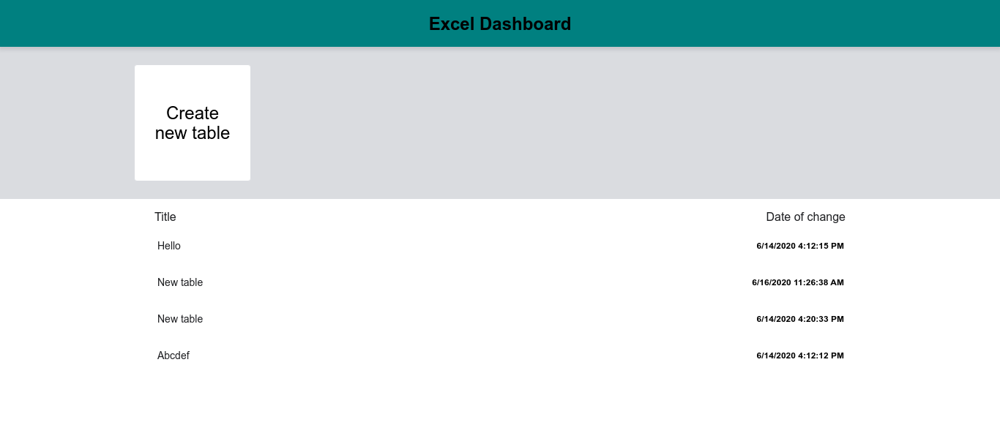
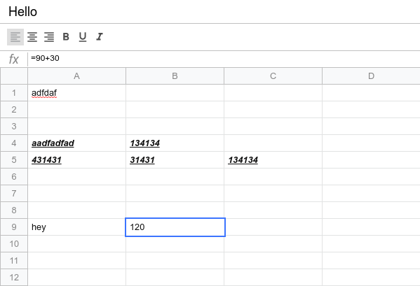
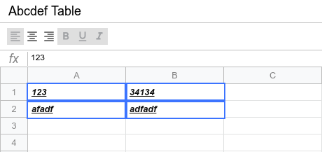
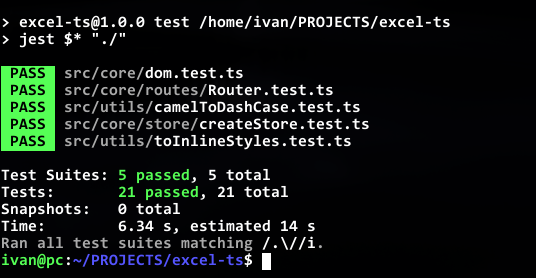

# Frontend course.

<h3 style='font-size: 18px;'>
  About the application: 
</h3>

  Simple excel clone coded in typescript and javascript.

<b style='font-size: 18px;'>
  Technologies and libraries: 
</b>

<ul>
  <li>
    Webpack - base builder for project.
  </li>
  <li>
    Typescript - programming language for static typing.
  </li>
  <li>
    Jest - library for testing.
  </li>
  <li>
    SASS(SCSS) - preprocessor for css.
  </li>
  <li>
    ESLint + Prettier - rules for writing code + error checking.
  </li>
  <li>
    Env-cmd - library for convenient use of environment variables, ex. for development or production mode.
  </li>
  <li>
    material-design-icons - icons for UI.
  </li>
</ul>

<h3 style='font-size: 18px;'>
  Advantages: 
</h3>
<ul>
  <li>Development using native browser api, eg. localstorage and DOM.</li>
  <li>Created a wrapper class for convenient working with DOM nodes a bit like a JQuery library.</li>
  <li>Simple implementation for Redux functional.</li>
  <li>Separate logic and view.</li>
  <li>First time used the knowledge of testing "in real life".</li>
  <li>Typescript and javascript experience.</li>
  <li>Created simple hash router.</li>
  <li>Used component approach.</li>
  <li>Scss fully used, eg mixins, variables and functions.</li>
</ul>

<h3 style='font-size: 18px;'>
  Disadvantages: 
</h3>
<ul>
  <li>To save time, often used type "any" for variables.</li>
  <li>In some cases data is stored in the view (data attribute).</li>
  <li>Single responsibility principle is ignored in some situation. </li>
  <li>Elsint warnings are ignored often.</li>
</ul>

<h3 style='font-size: 18px;'>
  Conclusion: 
</h3>

After completion this course, I've acquired practical skills,
such as: the JS and TS programming language capabilities.
I've used various technologies, such as webpack, sass, jest, etc.
The component-based, declarative methodology was used.
Classes were created through the interaction with html DOM.

